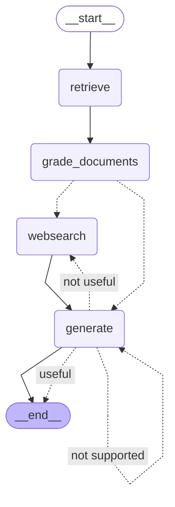
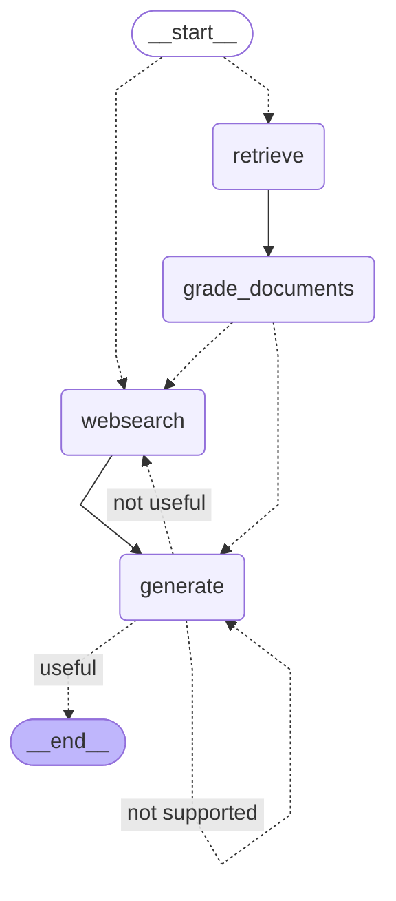

# advanced-rag

The repository structure should reflect the architecture of the project, which represent the nodes and edges implemented.


- `graph.py` - Connects all nodes and edges.
- `state.py` - Graph state objects that will be modified during the Graph execution.
- `consts.py` - Constants used in the implementation.
- `nodes/` - Contains the implementation of all nodes that will run.
- `chains/` - Each file will be a different chain that will correspond to a node (each node will run a LangChain chain).
- `tests/` - Contains the tests for the chains.
- `ingestion.py` - Hold the logic that will download information to be indexed in the vector store

## Self RAG

Reflect on the answer and compare it to the documents to check if the model hallucinated. 
Check if the result is grounded in the documents.



## Adaptive RAG

Fancy word for simply using a question router to route our prompt to different RAG flows.



### Running the project

Uncomment the **vectorstore** code at the ingestion file and run the project. A new `.chroma` folder will be created at the root of the application.

Once the vector data is generated, the **vectorstore** command can be commented out in order to avoid the same data ingestion everytime the project runs.

### Utilities

Installing Dependencies:
```sh
poetry add beautifulsoup4 langchain langgraph langchainhub langchain-community tavily-python langchain-chroma langchain_openai python-dotenv black isort pytest grandalf
```

Running tests:
```sh
pytest . -s -v
```

Environment variables - `.env` file:
```
OPENAI_API_KEY=<>
TAVILY_API_KEY=<>
LANGCHAIN_API_KEY=<>
LANGCHAIN_TRACING_V2=true
LANGCHAIN_PROJECT=CRAG
PYTHONPATH=</Users/../advanced-rag>
```

### Reference

- [Advanced RAG control flow with Mistral and LangChain](https://www.youtube.com/watch?v=sgnrL7yo1TE)
- [LangChain's Cookbook](https://github.com/mistralai/cookbook/tree/main/third_party/langchain)
- [langgraph-course repository from Eden Marco](https://github.com/emarco177/langgaph-course)
- [LangGraph- Develop LLM powered AI agents with LangGraph](https://www.udemy.com/course/langgraph/?couponCode=KEEPLEARNING)
- [Self-RAG: Learning to retrieve, generate, and critique through self-reflection](https://arxiv.org/pdf/2310.11511)
- [Adaptive RAG: Learning to Adapt Retrieval-Augmented Large Language Models through Question Complexity](https://arxiv.org/pdf/2403.14403)